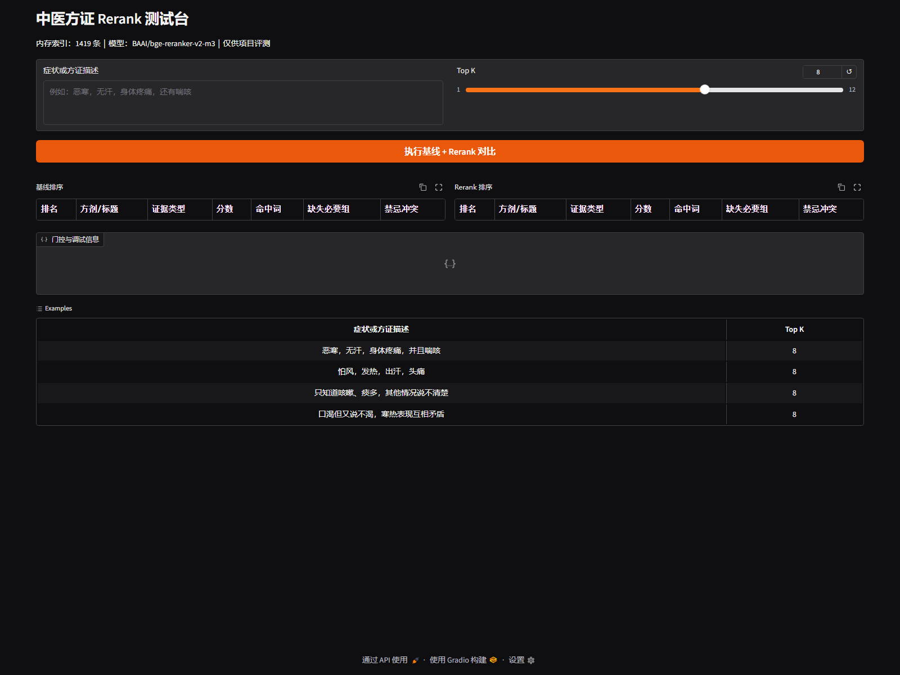
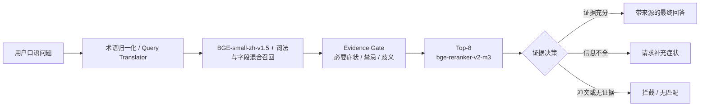

# 仲景智检：中医 Agentic RAG 检索与证据门控系统

一个面向中医方证、方剂、本草与古籍知识查询的工程化 RAG 项目。系统将口语症状映射到本地结构化证据，通过混合召回、必要症状与禁忌规则、Cross-Encoder 重排以及 LangGraph 工作流，输出一份可追溯的回答、澄清问题或无匹配提示。

> 本项目用于知识检索、工程验证和技术演示，不构成诊断、处方或临床准确率声明。涉及个人健康和用药的问题，应咨询具备资质的专业人员。



## 项目为什么这样做

普通 RAG 对完整、明确的问题通常能够直接检索，但中医口语问法经常存在症状不完整、古今术语不一致、多个方证共享症状和禁忌冲突等问题。单纯依赖向量相似度，容易出现“语义很像但证据条件不成立”的结果。

本项目把问题拆成三个层次：

1. **找得到**：用中文向量、词法匹配和结构化字段扩大候选召回。
2. **排得对**：对前 8 条候选使用 `bge-reranker-v2-m3` 做查询—证据联合打分。
3. **答得稳**：必要症状缺失时追问、出现禁忌冲突时拦截、证据不足时明确拒答，不让模型补齐知识库中不存在的结论。

Agentic 并不是为了给每个请求增加大模型调用。确定性的中医方证查询优先走可回归的结构化链路；只有多轮上下文、问题改写、澄清、工具选择和多结果聚合等需要决策的环节，才交给 LangGraph 编排。

## 已实现能力

- **中医资料处理**：支持 Markdown/JSON/JSONL 清洗、UTF-8 校验、来源字段保留和结构化抽取。
- **两类切分策略**：长篇古籍按 Markdown 标题构建父子块；方证记录按完整业务字段入库，不破坏必要症状、禁忌和原始出处之间的关系。
- **混合召回**：`BGE-small-zh-v1.5` 向量召回结合本地词法匹配、结构化字段重叠和融合排序。
- **语义重排**：在召回结果中选择前 8 条候选，使用 `bge-reranker-v2-m3` Cross-Encoder 重新排序。
- **Evidence Gate**：检查必要症状组、禁忌冲突、证据覆盖度和共享症状歧义，决定回答、追问或拒答。
- **Agentic 工作流**：LangGraph 负责会话摘要、查询改写、人工澄清中断、检索工具调用、上下文压缩、降级响应和答案聚合。
- **固定回归评测**：保留问题集、金标准、逐案例预测和汇总报告，区分效果收益与性能成本。
- **用户界面**：Gradio 页面只向用户展示一份经过重排和门控的最终回答；基线/Rerank 对比仅用于调试和评测。

## 技术路线



### 结构化检索链路

`datasets/structured/syndrome_dictionary.jsonl` 的每条记录保留来源、原始证据、古今症状、别名、必要症状组、禁忌项、鉴别项和需追问字段。演示环境共加载 **1,419 条结构化证据**。

检索时先获得较宽的候选集合，再执行以下约束：

- 必要症状没有出现：不直接给出方证结论，转为追问；
- 用户描述与禁忌字段冲突：保留冲突信息并拦截候选；
- 多个方证共享相似症状：询问能区分候选的关键症状；
- 本地证据无法支撑答案：返回无匹配提示，不调用模型自由补全。

重排采用 `evidence_first` 模式：Evidence Gate 的业务约束保持最高优先级，Cross-Encoder 只负责改善合格候选的相对顺序，不能绕过禁忌或缺项规则。

### 文档切分与上下文

项目对不同数据采用不同策略，而不是全部按固定字数切块：

- 古籍和长文档：先按 `H1/H2/H3` 切父块，再生成检索子块；当前配置为子块约 400 字符、重叠 80 字符，父块约 1,500–3,500 字符。
- 方剂和方证：一条业务记录作为一个完整证据单元，避免组成、主治、禁忌、必要症状和出处被切散。
- 回答阶段：子块用于准确召回，父块或完整结构化记录用于补足上下文；Agent 循环达到阈值后执行上下文压缩，避免重复证据持续占用窗口。

### LangGraph 在项目中的作用

LangGraph 不是向量数据库，也不负责计算相似度；它负责流程状态和条件路由：

```text
会话摘要 → 查询改写 → 是否需要澄清
                    ├─ 是：中断并等待用户补充
                    └─ 否：Agent 调用检索工具
                            → 必要时压缩上下文或降级
                            → 收集并聚合答案
```

图中设置了工具调用次数、循环次数和递归上限，避免 Agent 无限制调用工具。稳定的方证演示页默认关闭 LLM 症状翻译器，优先验证本地证据链；完整 Agentic 界面可按需配置本地或云端 LLM。

## 可复现评测结果

### 221 条锁定黑盒回归集

该回归集由 60 个方剂生成 221 条固定种子困难样本，并通过 Gradio API 测试真实页面边界，而不是绕过界面直接调用内部函数。

| 场景 | 样本数 | 基线 | Rerank |
|---|---:|---:|---:|
| 完整方证 | 60 | 100.00% | 100.00% |
| 必要症状缺失 | 60 | 98.33% | **100.00%** |
| 禁忌冲突 | 41 | 95.12% | 95.12% |
| 共享症状需澄清 | 60 | 71.67% | **85.00%** |
| **工程回归总体通过率** | **221** | **90.95%** | **95.02%** |

重排修复 10 条失败案例，同时产生 1 条退化，Top-1 变化 46 条。平均延迟从 582.00 ms 增至 725.51 ms，P95 从 843.10 ms 增至 1,088.90 ms，即增加约 **245.8 ms**。

### 538 条扩展困难集

在 150 个方剂、538 条合成困难样本上，总体通过率由 **93.87% 提升至 96.47%**，共享症状澄清由 **84.67% 提升至 93.33%**。

这些数字是固定规则下的**工程回归通过率**，不是临床准确率。数据由本地词典和规则生成，尚未经过执业中医师独立盲审。完整方法、原始汇总和边界说明见：

- [GPU Rerank 评测说明](docs/RERANK_GPU_EVALUATION.md)
- [锁定黑盒评测报告](datasets/structured/rerank_locked_v1_api_results/report.json)
- [服务器 GPU 实测与失败分析](docs/SERVER_GPU_RERANK_REPORT_20260629.md)

## 项目结构

```text
.
├── project/
│   ├── core/                 # 检索、Query Translator、门控与 RAG 初始化
│   ├── rag_agent/            # LangGraph 状态、节点、边和工具
│   ├── db/                   # Qdrant 与父块存储适配
│   ├── ui/                   # Gradio 页面与样式
│   ├── app.py                # 完整 Agentic RAG 入口
│   └── config.py             # 模型、分块、门控、端口等配置
├── scripts/
│   ├── rerank_gradio_demo.py # 中医方证用户界面与调试页
│   ├── run_gpu_rerank_ab.py  # GPU 基线/Rerank A/B
│   ├── evaluate_rerank_demo_api.py
│   └── build_* / validate_*  # 数据构建与质量校验
├── datasets/structured/      # 本地结构化字典与评测结果
├── tests/evals/              # 固定回归问题集
├── markdown_docs/            # 中医 Markdown 资料
├── docs/                     # 数据、评测、迁移和问题分析
└── requirements.txt
```

## 环境安装

服务器验收环境为 Ubuntu、Python 3.10.12、PyTorch 2.11.0+cu128 和 NVIDIA A100。其他 CUDA/PyTorch 组合请按实际驱动安装兼容版本。

```bash
python3 -m venv .venv-linux
source .venv-linux/bin/activate
python -m pip install --upgrade pip

# 先从 PyTorch 官方源安装与服务器驱动匹配的 CUDA wheel
pip install -r requirements.txt
pip install pytest
```

`requirements.txt` 不固定 PyTorch 版本，避免在不同 GPU 驱动环境中误装不兼容的 CUDA wheel。

### 本地模型和数据

模型权重、Hugging Face 缓存和活动向量库不会提交到 Git。启动前需准备：

```text
models/bge-reranker-v2-m3/model.safetensors
datasets/structured/syndrome_dictionary.jsonl
```

Embedding 默认使用 `BAAI/bge-small-zh-v1.5` 并以离线模式加载，可放入项目 Hugging Face 缓存，也可以通过环境变量 `DENSE_MODEL` 指向本地目录。

## 启动中医方证界面

先选择空闲 GPU 和未被占用的端口。以下编号和端口仅为示例：

```bash
export CUDA_VISIBLE_DEVICES=2
export RERANK_DEMO_SERVER_NAME=127.0.0.1
export RERANK_DEMO_SERVER_PORT=17860

.venv-linux/bin/python scripts/rerank_gradio_demo.py
```

共享服务器不要直接暴露 Gradio。通过 SSH 隧道访问：

```bash
ssh -N -L 17860:127.0.0.1:17860 -p 8080 <user>@<server>
```

本地浏览器打开 `http://127.0.0.1:17860/`。

完整 LangGraph 界面入口为：

```bash
.venv-linux/bin/python project/app.py
```

该入口需要在 `project/.env` 或环境变量中配置 LLM 和 Qdrant。API Key、模型权重和个人配置均不应提交到仓库。

## 运行评测

### GPU A/B

```bash
export HF_HOME="$PWD/.cache/huggingface"
export CUDA_VISIBLE_DEVICES=2

.venv-linux/bin/python scripts/run_gpu_rerank_ab.py \
  --device cuda \
  --dictionary datasets/structured/syndrome_dictionary.jsonl \
  --rerank-model models/bge-reranker-v2-m3 \
  --max-formulas 150 \
  --top-k 8 \
  --rerank-candidates 8 \
  --rerank-max-length 256 \
  --rerank-mode evidence_first \
  --output-dir datasets/structured/rerank_gpu_ab
```

### Gradio API 黑盒回归

先启动 `rerank_gradio_demo.py`，再运行：

```bash
python scripts/evaluate_rerank_demo_api.py \
  --url http://127.0.0.1:17860/ \
  --questions tests/evals/rerank_locked_v1/questions.jsonl \
  --gold tests/evals/rerank_locked_v1/private/gold_keys.jsonl \
  --output-dir datasets/structured/rerank_locked_v1_api_results
```

评测器会逐案例保存进度，并对临时 HTTP/隧道异常重试，任务中断后可以继续执行。

### 单元测试

```bash
.venv-linux/bin/python -m pytest -q
```

## 已解决的工程问题

| 问题 | 定位与处理 |
|---|---|
| Windows Qdrant 目录复制到 Linux 后不可用 | 不迁移活动数据库文件，使用原始结构化数据重新建索引。 |
| NFS 上 Qdrant Local/SQLite 出现损坏和 I/O error | 演示与评测使用进程内 Qdrant；生产环境应使用独立 Qdrant 服务并把 storage 放在本地块存储。 |
| 共享服务器无法稳定下载 Hugging Face 模型 | 模型和缓存放入项目私有目录，启动时启用 `local_files_only`。 |
| Rerank 首次请求慢、延迟增加 | 服务启动时预热模型，只重排前 8 条候选，并同时记录平均/P95 延迟。 |
| 排序变化不一定带来业务收益 | 建立固定回归集并逐案例记录收益与退化；Evidence Gate 不受重排分数绕过。 |
| 用户问题缺项或知识库无答案时模型可能补全 | 必要症状、禁忌和证据覆盖度先做确定性判断；不满足时追问或拒答。 |
| 多人服务器端口/GPU 冲突 | 使用 `CUDA_VISIBLE_DEVICES` 和独立端口隔离；服务仅监听 `127.0.0.1`，通过 SSH 隧道访问。 |

## 已知限制

- 当前 1,419 条证据索引在演示进程启动时重建，退出后不会持久化。
- Rerank 会增加计算开销；锁定黑盒测试中 P95 增加约 245.8 ms，因此生产配置保持可开关，而不是无条件启用。
- 早期 400 条规则集的基线已达到 100%，Rerank 没有提高通过率且存在名次退化；这说明“候选顺序变化”不能直接等同于业务效果提升。
- 固定回归集主要用于防止工程退化，不能替代专业中医人员审核或真实用户验证。
- PDF 文本型文档可先转为 Markdown；扫描版 PDF 仍需要额外 OCR 和人工版面校验。
- 完整 Agentic 链路依赖所选 LLM 的工具调用和指令遵循能力；稳定演示链路不会把 LLM 当作唯一安全边界。

## 如何增加知识内容

1. 确认资料来源、授权和可公开范围，不直接使用来源不明的医疗文本。
2. 将内容转换为 UTF-8 Markdown/JSONL，保留 `source_file`、`source_url`、章节和原文证据。
3. 长文档按标题和段落切分；方证、药物和禁忌信息按完整业务记录结构化。
4. 运行字典构建、质量审计和 Qdrant 重建脚本。
5. 为新增内容补充完整方证、缺项、禁忌冲突和共享症状等回归案例。
6. 先比较基线与新方案的逐案例变化，再决定是否调整 Top-K、阈值或启用重排。

不要直接把生成式模型的回答当作金标准。医疗领域的最终金标准应由独立、具备资质的专业人员审核。

## Git 提交边界

仓库应提交代码、配置示例、公开文档和可公开的汇总评测结果；以下内容通过 `.gitignore` 排除：

- `.env`、API Key 和其他凭据；
- Hugging Face 缓存、模型权重和 Qdrant 活动数据库；
- 虚拟环境、运行日志、临时文件和生成式预测明细；
- 个人简历、面试笔记和仅供内部使用的材料。

## 开源来源与许可

本项目在 [Agentic RAG for Dummies](https://github.com/GiovanniPasq/agentic-rag-for-dummies) 的 LangGraph 模块化架构基础上，完成了中医数据管线、中文检索、证据门控、BGE 重排、固定回归评测、服务器部署和用户界面的场景化重构。

代码许可见 [LICENSE](LICENSE)。第三方数据集和中医资料仍遵循各自来源的授权与使用条款，代码开源不等于自动获得所有数据的再分发权。
